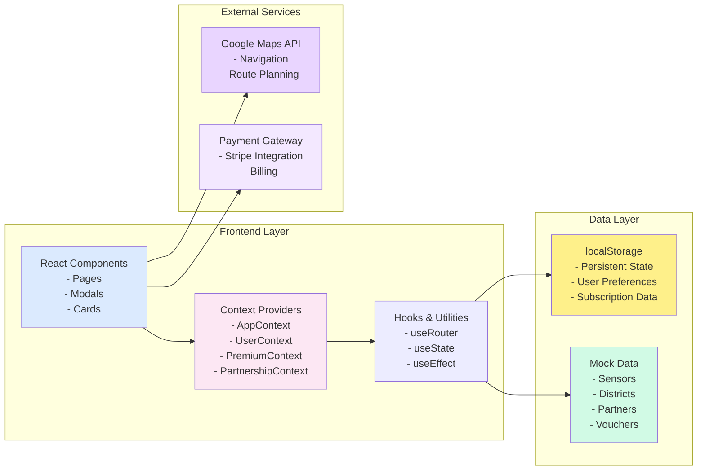
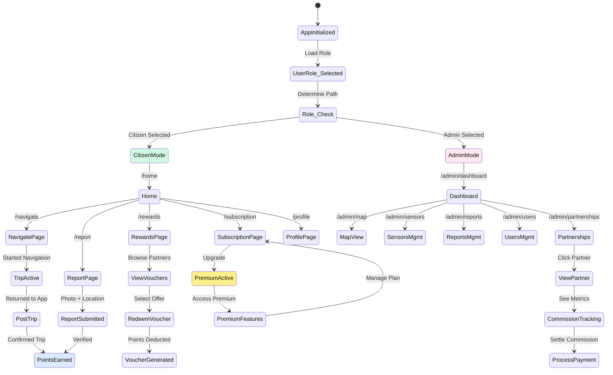
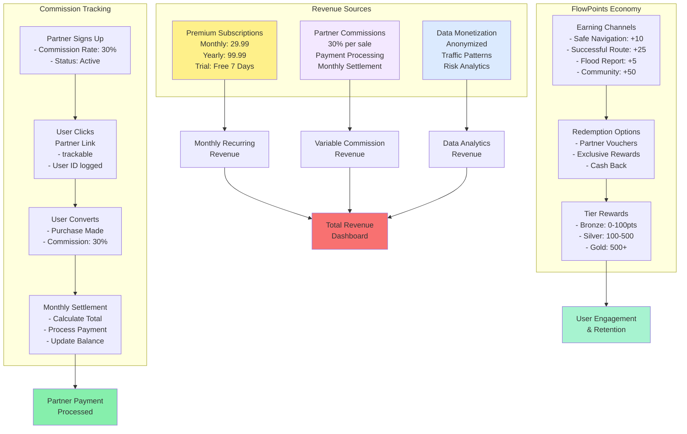
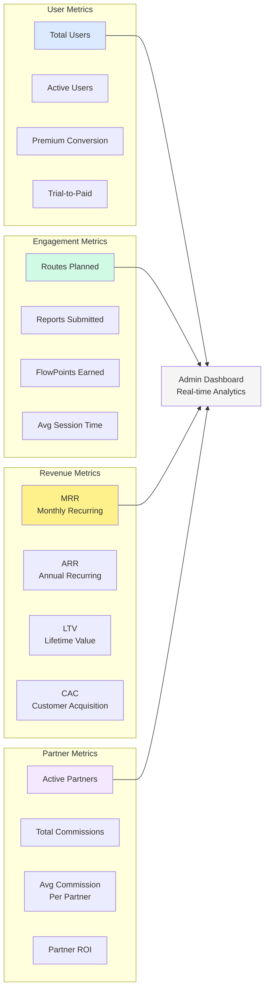

## FlowGuard Complete Product Flow & Architecture

```mermaid
graph TB
    subgraph "User Entry & Authentication"
        A["App Launch<br/>(/) Root"] --> B{Check User<br/>Role}
        B -->|Not Set| C["Redirect to /home<br/>(Citizen Default)"]
        B -->|Citizen| C
        B -->|Admin| D["Redirect to<br/>/admin/dashboard"]
    end

    subgraph "Citizen User Journey"
        C --> E["Home Page /home<br/>- Risk Indicator<br/>- Current Conditions<br/>- Premium Banner"]
        E -->|Premium Not Active| F["Show Premium Banner"]
        F -->|Click Banner| G["Premium Modal<br/>- Trial CTA<br/>- Plan Comparison"]
        G -->|Upgrade| H["Subscription /subscription"]
        H -->|Confirm Payment| I["Access Premium Features"]
        E -->|Navigate Safely| J["Navigate Page /navigate<br/>- Destination Input<br/>- Route Suggestions<br/>- Trip Tracking"]
        J -->|Start Navigation| K["Open Google Maps<br/>- Safe Route<br/>- Real-time GPS"]
        K -->|Return to App| L["Post-Trip Modal<br/>- Feedback<br/>- Report Accuracy"]
        L -->|Confirm Trip| M["Earn FlowPoints<br/>+ 10-50 pts"]
        M --> N["Reward Success Modal"]
        N --> O["Points Added<br/>to Account"]
        E -->|Report Flooding| P["Report Page /report<br/>- Photo Upload<br/>- Location Detect<br/>- AI Analysis"]
        P -->|Submit Report| Q["Earn FlowPoints<br/>+ 5 pts"]
        Q --> R["Report Confirmed"]
        E -->|Rewards| S["Rewards /rewards<br/>- FlowPoints Balance<br/>- Activity Summary"]
        S --> T["Partner Vouchers<br/>Grid"]
        T -->|Redeem Voucher| U["Use FlowPoints<br/>to Get Discount"]
        U --> V["Voucher Code<br/>Generated"]
        S --> W["View Earning<br/>Rules"]
        W --> X["Learn How to<br/>Earn Points"]
        S --> Y["Redemption<br/>Options"]
        Y -->|Select Reward| Z["Claim Reward<br/>FlowPoints Debited"]
        E -->|Profile| AA["Profile /profile<br/>- User Info<br/>- Trip History<br/>- Settings"]
        AA -->|Switch Role| AB["Toggle to Admin<br/>Mode"]
        AA -->|View Premium| AC["Subscription /subscription<br/>- Current Plan<br/>- Billing History<br/>- Features List"]
        AA -->|Sign Out| AD["Clear Local<br/>Storage"]
    end

    subgraph "Admin Workflow"
        D --> AE["Admin Dashboard<br/>/admin/dashboard<br/>- System KPIs<br/>- Alert Overview"]
        AE --> AF["Navigation Tabs"]
        AF -->|Map| AG["Sensor Map<br/>/admin/map<br/>- Leaflet Map<br/>- Real-time Markers<br/>- Location Click"]
        AF -->|Sensors| AH["Sensors /admin/sensors<br/>- Status List<br/>- Battery Level<br/>- Water Level"]
        AF -->|Reports| AI["Community Reports<br/>/admin/reports<br/>- Flood Reports<br/>- Verification<br/>- Analytics"]
        AF -->|Users| AJ["User Management<br/>/admin/users<br/>- Account Info<br/>- Activity Logs"]
        AF -->|Partnerships| AK["Partnerships /admin/partnerships<br/>- Active Partners<br/>- Commission Tracking<br/>- Performance Metrics<br/>- Payment Processing"]
        AK -->|View Partner| AL["Partner Detail Modal<br/>- Contact Info<br/>- Commission Rate<br/>- Total Earnings<br/>- Monthly Breakdown"]
        AL -->|Process Payment| AM["Record Commission<br/>Payment"]
        AM --> AN["Update Partner<br/>Balance"]
        AF -->|Analytics| AO["Analytics Page<br/>/admin/analytics<br/>- Detailed Reports<br/>- Trends<br/>- Forecasts"]
    end

    subgraph "Monetization Features"
        H -->|Free Plan| AP["Features:<br/>- Basic Navigation<br/>- Standard Reports<br/>- 50 FlowPoints/month<br/>- Community Rewards"]
        H -->|Premium Monthly| AQ["Features:<br/>- Advanced Routing<br/>- Priority Alerts<br/>- 200 FlowPoints/month<br/>- Partner Vouchers<br/>- Ad-Free<br/>29.99/mo"]
        H -->|Premium Yearly| AR["Features:<br/>- All Premium+<br/>- Offline Maps<br/>- 300 FlowPoints/month<br/>- Early Access<br/>99.99/yr"]
        H -->|Trial| AS["7-Day Free Trial<br/>- Full Premium Access<br/>- Auto-renews unless<br/>cancelled<br/>- Available once"]
        AP --> AT["Free + Partnership"]
        AQ --> AU["Premium + Partnership"]
        AR --> AV["Premium + Partnership"]
        AS --> AW["Trial + Partnership"]
        AT -->|Partnership Commission| AX["30% per sale<br/>Commission Pool"]
        AU -->|Partnership Commission| AX
        AV -->|Partnership Commission| AX
        AW -->|Partnership Commission| AX
        AX --> AY["Track by:<br/>- Partner ID<br/>- Date Range<br/>- Revenue Source"]
    end

    subgraph "Data & Context Layers"
        BA["useApp Context<br/>- currentDistrict<br/>- currentRisk<br/>- sensors[]<br/>- refreshData()"]
        BB["useUser Context<br/>- userPoints<br/>- userTier<br/>- addFlowPoints()"]
        BC["usePremium Context<br/>- subscription<br/>- isPremium<br/>- isTrialActive<br/>- cancelSubscription()"]
        BD["usePartnership Context<br/>- partnerships[]<br/>- commissions[]<br/>- getPartnerMetrics()"]
        BA --> BE["Mock Data:<br/>- sensors-full.ts<br/>- districts.ts<br/>- alerts.ts"]
        BB --> BF["localStorage<br/>- userPoints<br/>- tripHistory<br/>- settings"]
        BC --> BG["localStorage<br/>- subscription<br/>- trialDate<br/>- billingCycle"]
        BD --> BH["localStorage<br/>- partnerships<br/>- commissions<br/>- vouchers"]
    end

    subgraph "Key Integration Points"
        BI["Bottom Navigation<br/>- 6 Tabs<br/>- Home<br/>- Navigate<br/>- Report<br/>- Rewards<br/>- Premium<br/>- Profile"]
        BJ["Admin Header Nav<br/>- 6 Routes<br/>- Dashboard<br/>- Map<br/>- Sensors<br/>- Reports<br/>- Users<br/>- Partnerships"]
        BK["Layout Hierarchy<br/>- Citizen Layout<br/>  + All Providers<br/>  + Bottom Nav<br/>- Admin Layout<br/>  + Header Nav<br/>  + Main Content"]
    end

    O --> C
    V --> S
    Z --> S
    AM --> AK
    C -.->|Responsive<br/>Mobile First| BE
    AE -.->|Analytics<br/>Real-time| BA

    style A fill:#e8f4f8
    style G fill:#f3e8ff
    style H fill:#f3e8ff
    style I fill:#d1fae5
    style S fill:#fef08a
    style AK fill:#f3e8ff
    style AM fill:#dbeafe
    style BI fill:#f5f5f5
    style BJ fill:#f5f5f5
```



### System Architecture



### State Management Flow



### Revenue Streams & Commission Flows



### Feature Access Matrix

```mermaid
table
    tr
        td: b Feature
        td: b Free
        td: b Premium (Monthly)
        td: b Premium (Yearly)
        td: b Trial (7 Days)
    tr
        td: Basic Navigation
        td: ✓
        td: ✓
        td: ✓
        td: ✓
    tr
        td: Advanced Routing
        td: ✗
        td: ✓
        td: ✓
        td: ✓
    tr
        td: Priority Alerts
        td: ✗
        td: ✓
        td: ✓
        td: ✓
    tr
        td: Ad-Free Experience
        td: ✗
        td: ✓
        td: ✓
        td: ✓
    tr
        td: Offline Maps
        td: ✗
        td: ✗
        td: ✓
        td: ✗
    tr
        td: Monthly FlowPoints
        td: 50
        td: 200
        td: 300
        td: 200
    tr
        td: Partner Vouchers
        td: Basic
        td: Premium
        td: Premium+
        td: Premium
    tr
        td: Early Feature Access
        td: ✗
        td: ✗
        td: ✓
        td: ✗
    tr
        td: Support Priority
        td: Standard
        td: Priority
        td: VIP
        td: Priority
```

### Key Metrics & Analytics


